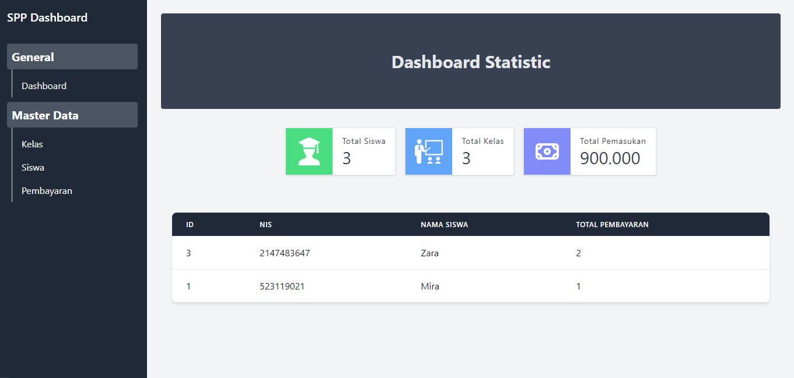
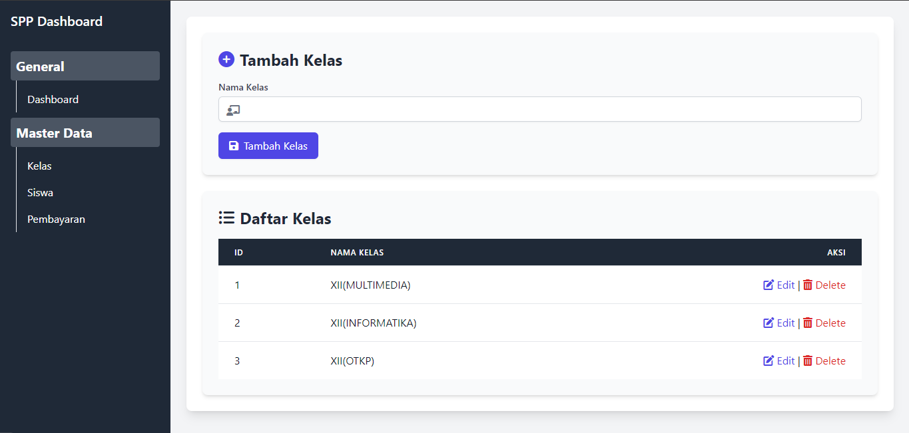
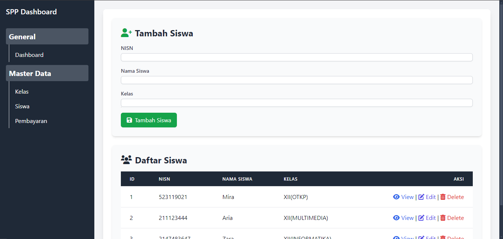
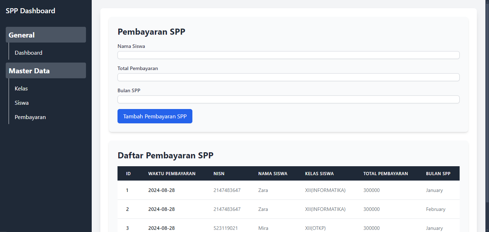

# SPP-Payments


**SPP-Payments** is a project designed for educational purposes only. Redistribution of this project is not permitted.

This project is licensed under the [MIT License](./LICENSE.txt).

---

## Table of Contents

- [Introduction](#introduction)
- [Directory Structure](#directory-structure)
- [Setup and Installation](#setup-and-installation)
- [Usage](#usage)
- [License](#license)
- [Contact](#contact)

---

## Introduction

SPP-Payments is a web-based application designed to manage and track payments for school tuition fees. This project showcases basic functionalities such as payment processing, user management, and reporting.

## Directory Structure

Below is the structure of the project directory:

```
SPPAY
├── database
│   └── sppayment.sql
├── pages
│   ├── content
│   │   ├── dashboard.php
│   │   ├── kelas.php
│   │   ├── pembayaran.php
│   │   ├── sidebar.php
│   │   └── siswa.php 
│   └── index.php
├── php
│   ├── db_connect.php
│   ├── edit_class.php
│   ├── get_classes.php
│   ├── manage_classes.php
│   ├── manage_payments.php
│   └── manage_students.php
├── source
│   ├── image
│   │   ├── dashboard.png
│   │   ├── kelas.png
│   │   ├── payment.png
│   │   ├── SPP PAYMENTS THX.png
│   │   └── SPP PAYMENTS.png
│   ├── js
│   │   └── global.js
│   └── style
│       └── style.css
├── LICENSE.txt
└── README.md
```

- **`database/`**: Contains the SQL file used for setting up the database.
- **`pages/`**: Holds the page content files.
- **`php/`**: Contains PHP scripts and server-side logic.
- **`source/`**: Includes JavaScript and CSS files for front-end functionality.
- **`LICENSE.txt`**: License information for the project.
- **`README.md`**: This file.

## Setup and Installation

To set up this project on your local machine, follow these steps:

1. **Clone the Repository:**

   ```bash
   git clone https://github.com/yourusername/SPP-Payments.git
   ```

2. **Navigate to the Project Directory:**

   ```bash
   cd SPP-Payments
   ```

3. **Set Up the Database:**

   Import the `sppayment.sql` file into your MySQL database.

4. **Configure the Application:**

   Update the database connection settings in the PHP files as needed.

5. **Run the Application:**

   Launch your local web server and navigate to the project's root directory in your browser.

## Usage

Once the application is set up, you can start using it to manage tuition payments. Access the application via your local server and follow the on-screen instructions.

## Gallery

#### Dashboard pages

#### Class pages

#### students pages

#### Transaction pages


## License

This project is licensed under the [MIT License](./LICENSE.txt). See the `LICENSE.txt` file for more details.

## Contact

For any questions or further information, please reach out to:

- **Email**: [officialbangezz@gmail.com](mailto:officialbangezz@gmail.com)
- **GitHub**: [exzgit](https://github.com/exzgit)


---